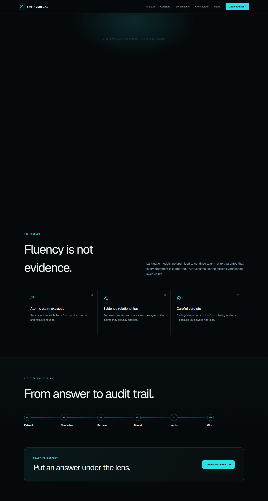
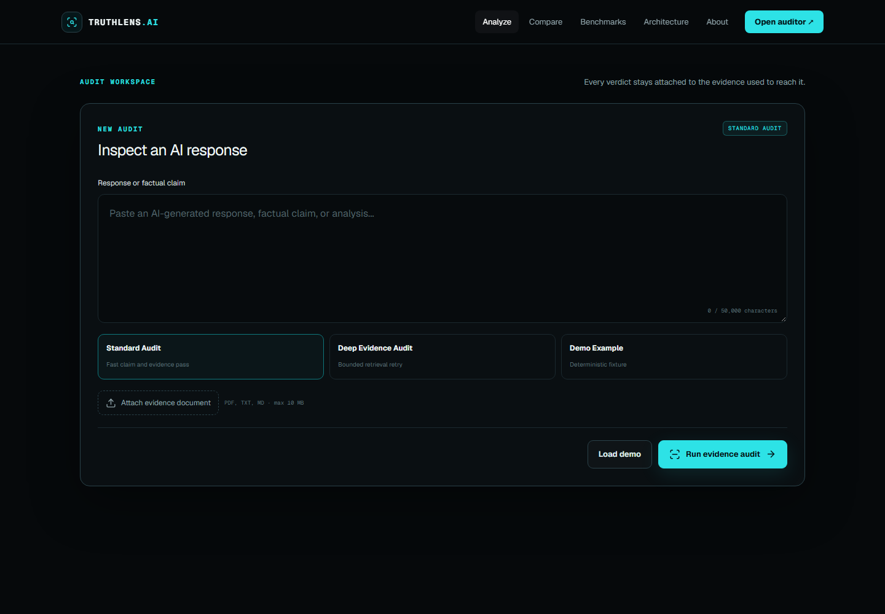

#  Tips Hindawi Internship (August–October) 2026

>  This project was built during the Tips Hindawi Internship (August–October) 2026.

##  Participant

| Field | Value |
| --- | --- |
| Full Name | Mahmoud Maher El-Said |
| Project Name | TruthLens AI — AI Response Auditor & Evidence Verification Engine |
| GitHub Username | Mahmoud-Maher-Elsaid |
| Internship Batch | August–October 2026 |
| Training Program | Large Language Models (LLMs) Program |
| Organization | [**Edrak for Ai**](https://edrak4ai.com/en) |

---

#  Project Overview

**Don't trust an answer. Verify it.**

TruthLens AI is an AI response auditing and evidence verification engine. It breaks generated or user-provided responses into atomic factual claims, retrieves relevant evidence, reranks evidence, performs NLI-based verification, detects contradictions and insufficient evidence, and produces structured evidence-backed reports.

```text
Input
→ Atomic Claim Extraction
→ Claim Normalization
→ Evidence Retrieval
→ Reranking
→ Verification
→ Evidence Strength / Confidence
→ Contradiction Detection
→ Correction
→ Citations
→ Structured Report
```

TruthLens uses three verdicts:

- `SUPPORTED`
- `CONTRADICTED`
- `INSUFFICIENT_EVIDENCE`

`INSUFFICIENT_EVIDENCE` does not mean false. It means the available evidence is not sufficient to support or contradict the claim.

# ✨ Features

- Atomic claim extraction and normalization.
- Evidence retrieval with FAISS for local use and a Qdrant production adapter.
- Cross-encoder reranking and NLI-based claim verification.
- Evidence-strength reporting, contradiction detection, and conflicting-evidence handling.
- Structured citations and an interactive evidence graph.
- PDF, TXT, and Markdown document upload and indexing.
- Streaming analysis API with explicit fallback and provider reporting.
- Clearly labeled Base / RAG / TruthLens illustrative comparison view.
- Benchmark dashboard that renders measured artifacts only.
- n8n analysis-to-human-review routing and quality monitoring workflows.

# ️ Technologies Used

| Area | Technologies |
| --- | --- |
| Frontend | Next.js 16, React 19, TypeScript, Tailwind CSS, Motion, React Flow, Recharts, Zod, Sonner |
| Backend | FastAPI, Pydantic v2, LangChain, LangGraph |
| ML and retrieval | PyTorch, Transformers, Sentence Transformers, PEFT, FAISS, Qdrant |
| Automation | n8n, Docker |
| Testing and quality | pytest, Vitest, Playwright, Ruff, ESLint, TypeScript type checking |

Production ML components:

| Role | Component |
| --- | --- |
| Embedding model | `sentence-transformers/all-MiniLM-L6-v2` |
| Reranker | `cross-encoder/ms-marco-MiniLM-L-6-v2` |
| Production verifier | `cross-encoder/nli-deberta-v3-small` |
| Fine-tuning base | `Qwen/Qwen2.5-1.5B-Instruct` |

# ⚙️ Installation

The verified local workflow is PowerShell-first on Windows with Python 3.11. WSL is not required. Docker is optional for n8n only.

```powershell
# Run from the repository root.
py -3.11 -m venv services\ai-api\.venv
& .\services\ai-api\.venv\Scripts\python.exe -m pip install -r .\services\ai-api\requirements-dev.txt
. .\scripts\set_model_cache.ps1
Set-Content .\apps\web\.env.local 'NEXT_PUBLIC_API_BASE_URL=http://localhost:8000'
Set-Location .\apps\web
npm ci
```

Use `.env.example` as the backend configuration reference. Keep API keys, tokens, and credentials in untracked local environment files only.

#  Usage

Start the FastAPI service on the Windows host in one PowerShell window:

```powershell
# Run from the repository root.
. .\scripts\set_model_cache.ps1
$env:TRUTHLENS_MODE='LOCAL'
$env:TRUTHLENS_VERIFIER_PROVIDER='baseline'
$env:TRUTHLENS_VERIFIER_MODEL='cross-encoder/nli-deberta-v3-small'
& .\services\ai-api\.venv\Scripts\python.exe -m uvicorn app.main:app --app-dir .\services\ai-api --host 0.0.0.0 --port 8000
```

Start the frontend in a second PowerShell window:

```powershell
Set-Location .\apps\web
npm run dev
```

Open `http://localhost:3000` and use **Analyze** to submit a response or factual claim. Attach a PDF, TXT, or Markdown file when additional evidence should be indexed. The UI validates upload results before analysis, shows streaming progress, and presents claim-level verdicts, citations, and the evidence graph.

For local automation, FastAPI runs on the Windows host while n8n runs locally in Docker. n8n reaches FastAPI through `http://host.docker.internal:8000`.

```text
TRUTHLENS_API_BASE_URL=http://host.docker.internal:8000
TRUTHLENS_MIN_BASELINE_MACRO_F1=0.6758189800742992
N8N_BLOCK_ENV_ACCESS_IN_NODE=false
```

The persistent n8n Docker volume is `truthlens_n8n_data`. No ngrok or WSL runtime is required for normal local development. See [automation/n8n/README.md](automation/n8n/README.md) for import and smoke-test instructions.

#  Demo

TruthLens provides these local application flows:

- **Analyze:** live claim-level auditing, upload, evidence, citations, and report display.
- **Compare:** an explicitly labeled illustrative/precomputed Base / RAG / TruthLens fixture; it is not a three-system benchmark.
- **Architecture:** interactive system map.
- **Benchmarks:** measured benchmark artifacts and unavailable states when the API cannot provide data.
- **n8n automation:** analysis-to-human-review routing and scheduled quality monitoring.

The repository includes valid local screenshots:





No public deployment URL is claimed.

#  Results

| Evaluation | Measured result |
| --- | --- |
| Held-out production baseline | 180 balanced samples, 60 per class; accuracy `0.6944444444`, macro F1 `0.6758189801` |
| Experiment 1 | Accuracy `0.6111111`, macro F1 `0.6092125` |
| Experiment 2 | Accuracy `0.5611111`, macro F1 `0.5514736` |
| Experiment 3 | Accuracy `0.6444444444`, macro F1 `0.6232936923` |
| Real LOCAL end-to-end suite | **6/6 expected-case matches on the defined real end-to-end validation suite**; 6 completed, 0 failed, no fallback detected |
| Quantization | Higher precision macro F1 `0.675819`; NF4 macro F1 `0.660335`; about `61.06%` model-memory reduction, but NF4 was slower and slightly less accurate |
| Frontend validation | ESLint PASS, TypeScript PASS, Vitest PASS (10 tests), Playwright PASS (5 tests), production Next.js build PASS |
| n8n runtime | Analysis / Human Review workflow PASS; Quality Monitor workflow PASS |

The pretrained baseline verifier remains the production model because Experiments 1, 2, and 3 did not outperform it on the frozen held-out protocol. Experiment 3 is preserved as an honest negative experiment and is not promoted. The 6/6 end-to-end result is a defined-suite result, not general model accuracy.

#  Future Improvements

- Expand source diversity and evaluate retrieval across additional domains.
- Improve insufficient-evidence handling with validation-controlled research only.
- Add calibrated confidence only after a separate calibration study.
- Strengthen production Qdrant operations and document-isolation controls.
- Add multilingual and adversarial evaluation suites without changing the frozen benchmark protocol.

#  About the Internship

This project was developed as part of the [**Tips Hindawi**](https://www.tipshindawi.com/) **Internship (August–October) 2026**, and it will be showcased on the official [Tips Hindawi](https://www.tipshindawi.com/) website.

[Tips Hindawi](https://www.tipshindawi.com/) is the internships department of [**Edrak for Ai**](https://edrak4ai.com/en), and the internship encourages participants to build real-world projects, apply practical skills, and showcase their work through GitHub.

For more information about the internship, training programs, and upcoming batches, visit the official [Tips Hindawi](https://www.tipshindawi.com/) website.

#  License

This project is shared for educational and portfolio purposes.
